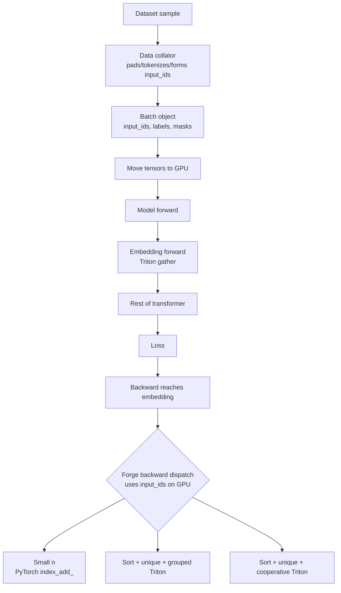
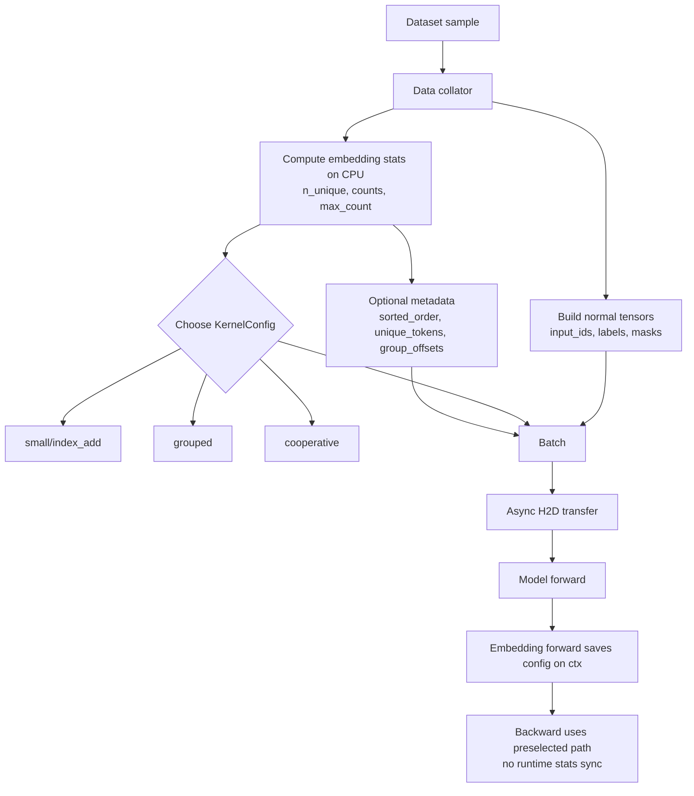

# Embedding Kernel Research

This document explains the embedding kernel as a system problem: what data
flows through it, which dispatch decisions exist, how PyTorch/Liger/Forge and
related frameworks handle it, and whether collator-stage dispatch can produce
real impact.

The short answer: embedding is a good candidate, but only for the backward
pass. Forward embedding is mostly a shape-tuned gather. Backward embedding is a
data-dependent scatter/reduce problem where duplicate token IDs can change the
best algorithm.

Local code references:

- Forge experiment: `kernels/embedding/experiments/v1/embedding_kernel_v1_upgrade_1.py`
- Forge package shim: `forge/forge/kernels/embedding.py`
- Forge patch wiring: `forge/forge/patching/core.py`
- Liger reference: `kernels/embedding/reference/liger/embedding_kernel.py`
- Tests: `kernels/embedding/tests/test_embedding.py`
- Benchmarks: `kernels/embedding/benchmarks/bench_embedding.py`


## 1. What an Embedding Layer Actually Does

An embedding layer is a learnable lookup table.

```text
W           : [vocab_size, embedding_dim]
input_ids   : [batch, seq] or any integer shape
output      : [batch, seq, embedding_dim]

output[b, t, :] = W[input_ids[b, t], :]
```

For language models:

- `vocab_size` is often 32k to 256k+.
- `embedding_dim` is the model hidden size, for example 768, 2048, 4096, 8192.
- `input_ids` are integer token IDs produced by the tokenizer/collator.
- The same token ID can appear many times in one batch.

Forward is a gather. For every token position, read one row from `W` and write
one row to `output`.

Backward is a scatter-add. For every token position, add its gradient into the
row of `grad_W` that corresponds to the token ID.

```text
forward:
  output[i, :] = W[input_ids[i], :]

backward:
  grad_W[input_ids[i], :] += grad_output[i, :]
```

The forward has no race condition because every output row is independent. The
backward has a race condition because many token positions can update the same
embedding row.


## 2. The Core Problem

The difficult part is duplicate token IDs.

Example:

```text
input_ids   = [1, 3, 1, 4, 1, 3]
grad_output = [g0, g1, g2, g3, g4, g5]

grad_W[1] = g0 + g2 + g4
grad_W[3] = g1 + g5
grad_W[4] = g3
```

If a kernel launches one parallel worker per token position, then repeated
tokens all try to update the same `grad_W[row]`. That needs atomics or some
kind of grouping/reduction.

The shape of the problem is not enough. These two batches can have identical
shape but very different backward behavior:

```text
Batch A: mostly unique IDs
  n_tokens = 8192
  n_unique = 8100
  max_count = 2

Batch B: high duplication
  n_tokens = 8192
  n_unique = 500
  max_count = 200
```

The best backward algorithm can be different for A and B.


## 3. Variables That Matter

### Static Variables

These are known from the model/module:

| Variable | Meaning | Why it matters |
|---|---|---|
| `V` / `vocab_size` | Number of rows in the embedding table | Dense `grad_W` size is `V * D`. |
| `D` / `embedding_dim` | Width of each row | Controls memory traffic and tile size. |
| dtype | fp32, fp16, bf16 | Controls bandwidth, accumulator choice, numeric tolerance. |
| `padding_idx` | Token row that must not receive gradients | Correctness issue. |
| `scale_grad_by_freq` | Divide each row gradient by its frequency in the batch | Requires counts. |
| `max_norm` | Renormalize selected rows in forward | Adds a forward-side update. |
| `sparse=True` | Return sparse gradient for `weight` | Changes optimizer compatibility and memory behavior. |

### Batch Variables

These are known from `input_ids`, often before GPU execution:

| Variable | Meaning | Why it matters |
|---|---|---|
| `n_tokens` | Number of token positions | Controls total work. |
| `n_unique` | Number of unique token IDs | Controls number of touched rows. |
| `counts[token]` | Frequency of each token ID | Needed for duplicate-aware reduction. |
| `max_count` | Largest duplicate group | Decides whether a group should be split across workers. |
| duplicate ratio | `1 - n_unique / n_tokens` | Cheap summary of contention risk. |
| pad/eos/bos counts | Frequency of special tokens | Often the hottest rows. |
| sorted order | Positions grouped by token ID | Lets backward reduce without atomics. |
| group offsets | Start/end of each token group in sorted order | Needed for segmented reduction. |

### Runtime-Only Variables

These are not known at collation time:

| Variable | Why it is runtime-only |
|---|---|
| `grad_output` values | Produced by the rest of the model during backward. |
| actual numeric row sums | Need `grad_output`. |
| optimizer update values | Depend on gradients and optimizer state. |

The key point: the collator can know where reductions will happen, but not what
the reduction values are.


## 4. Current End-to-End Flow

This is the current high-level flow when Forge patches an `nn.Embedding`.



Where dispatch happens today:

- Forward tile-size selection happens inside Triton autotune using shape keys
  `n_elements` and `embedding_dim`.
- Backward algorithm selection happens inside `ForgeEmbeddingFunction.backward`.
- The current backward dispatch sorts `input_ids` on GPU, computes unique
  tokens/counts, then calls `counts.max().item()` to choose grouped vs
  cooperative. That `.item()` creates a CPU/GPU sync point.

Important distinction: Triton autotune is config dispatch, not algorithm
dispatch. It benchmarks block sizes for the same kernel family. The Forge
backward branch chooses a different algorithm family.


## 5. Current Forge Implementation

### Forward

Forge uses a Triton tiled gather:

```text
grid = ceil(n_tokens / BLOCK_M) x ceil(D / BLOCK_N)

each program:
  load token IDs for a small token tile
  load W[token_id, dim_tile]
  store output[token_position, dim_tile]
```

The forward kernel has Triton autotune configs such as:

```text
BLOCK_SIZE_M, BLOCK_SIZE_N:
  32 x 256
  64 x 128
  32 x 128
  128 x 128
  64 x 256

autotune key:
  ["n_elements", "embedding_dim"]
```

This means the forward is already shape-dispatched by Triton. The collator
does not add much here except possible prewarming for common shapes.

### Backward

Forge currently has three backward paths:

```text
if n_elements < 256:
    grad_weight.index_add_(0, indices_flat, grad_output)
else:
    sorted_indices, sorted_order = torch.sort(indices_flat, stable=True)
    unique_tokens, counts = torch.unique_consecutive(sorted_indices, return_counts=True)
    group_offsets = cumsum(counts)
    max_gs = int(counts.max().item())

    if max_gs > 32:
        cooperative two-phase reduction
    else:
        grouped one-phase reduction
```

The three paths:

| Path | Current threshold | Best when | Main cost |
|---|---:|---|---|
| `index_add_` fallback | `n < 256` | Tiny inputs where sorting is not worth it | Atomics/index-add behavior. |
| Grouped reduction | `max_count <= 32` | Many unique tokens, small duplicate groups | GPU sort/unique and one program serially loops over each group. |
| Cooperative reduction | `max_count > 32` | Few unique tokens or hot repeated tokens | Scratch buffer and two kernel launches. |

The grouped and cooperative paths avoid atomics by making each final
`grad_W[row]` owned by exactly one final writer.


## 6. Existing Kernel/Algorithm Variants

This table is the practical inventory of embedding variants connected to this
problem.

| Variant | What it does | Present where | Good when | Reject/accept for Forge collator dispatch |
|---|---|---|---|---|
| Plain forward gather | Reads `W[input_ids]` and writes dense output | PyTorch, Liger, Forge, most frameworks | Always needed | Accept only for shape prewarm; no strong content-dependent choice. |
| Atomic scatter backward | Each token position atomically adds into `grad_W` | Liger reference; common simple custom kernels | Mostly unique tokens, no preprocessing overhead | Accept as a baseline/fallback; weak for high duplicates. |
| Small-input dense backward | Specialized path for small `n` | PyTorch CUDA source has a small path; Forge uses `index_add_` under 256 | Small batches | Accept as fallback. |
| Sort + segmented reduction | Sort IDs, group duplicates, reduce each group | PyTorch dense CUDA path for larger inputs; Forge grouped path | Duplicate-heavy exact training | Accept, but not novel by itself. |
| Cooperative grouped reduction | Split hot duplicate groups across multiple programs before final reduce | Forge current experiment | High `max_count`, low `n_unique`, large `D` | Strong accept; this is where content-aware dispatch matters. |
| `scale_grad_by_freq` | Divide row gradient by token frequency | PyTorch `nn.Embedding` | Models that enable it | Must support or explicitly fall back. It uses the same counts metadata. |
| `padding_idx` skip | Do not update the pad row | PyTorch `nn.Embedding` | Any model with a pad token row | Must support before broad patching. |
| `max_norm` renorm | Renormalize touched rows in forward | PyTorch `nn.Embedding` | Rare in LLMs, common in some embedding training setups | Reject for v1 optimization; support by fallback or separate implementation. |
| Sparse gradient | Return sparse grad for `weight` instead of dense `grad_W` | PyTorch `nn.Embedding(sparse=True)` | Huge vocabulary, few touched rows, supported optimizer | Not a drop-in for AdamW LLM training. Accept only as a separate optimizer-aware path. |
| EmbeddingBag | Lookup and reduce bags by sum/mean/max without materializing all token embeddings | PyTorch, TorchRec/FBGEMM | Recommender systems and bag-of-features models | Reject for normal LLM token embeddings because it changes output semantics. |
| Table Batched Embeddings | Batch many embedding tables/bags into optimized kernels, often with fused optimizers and sharding | TorchRec/FBGEMM | Large-scale recommender systems | Related but not same target. Reject for Forge v1 unless targeting recsys/jagged features. |
| Quantized/frozen embedding lookup | Store rows in int8/int4 or other compressed format | Inference systems, FBGEMM-style operators | Inference or frozen embeddings | Reject for exact training kernel. |
| Sharded/vocab-parallel embedding | Split rows or dimensions across devices | TorchRec, Megatron-style model parallel systems, FSDP variants | Very large tables/models | Out of scope for local single-kernel POC; relevant later. |


## 7. Frameworks and How They Handle It

### PyTorch `nn.Embedding`

PyTorch exposes the full semantic surface:

- `padding_idx`: the pad row does not contribute to gradient.
- `max_norm`: forward can renormalize selected rows in-place.
- `scale_grad_by_freq`: backward scales each row by inverse mini-batch
  frequency.
- `sparse=True`: gradient with respect to `weight` is sparse.

The docs also note that sparse gradients only work with a limited optimizer set:
SGD, SparseAdam, and CPU Adagrad. That is why `sparse=True` is not a universal
drop-in for LLM fine-tuning with AdamW.

PyTorch CUDA source is important for novelty: dense embedding backward is not
just a naive `index_add_`. The current source has a small-input path and a
larger path that sorts indices, tracks original positions, computes counts when
`scale_grad_by_freq` is enabled, and then launches a CUDA kernel over grouped
indices. So:

- sorting/grouping for embedding backward is already known;
- `padding_idx` and `scale_grad_by_freq` are already integrated;
- the open question is whether Forge can beat PyTorch for specific duplicate
  regimes or remove runtime preprocessing/sync overhead by moving decisions and
  metadata earlier.

### PyTorch `nn.EmbeddingBag`

`EmbeddingBag` is related but not equivalent. It computes bag-level reductions
such as sum, mean, or max without materializing the intermediate
`[tokens, D]` embedding tensor.

That is valuable for recommender systems or bag-of-words-style features. It is
not a drop-in replacement for LLM token embedding because a transformer needs
one vector per token position, not one pooled vector per sequence/bag.

### Hugging Face Transformers

Hugging Face model implementations generally expose token embeddings as normal
PyTorch modules. For the Forge-supported mappings:

- Qwen exposes token embeddings as a vanilla `nn.Embedding` at
  `model.embed_tokens`.
- Gemma uses the same basic module-level pattern for token embedding.
- Forge patches the module's `forward` method rather than replacing the module.

Current Forge patching calls:

```python
ForgeEmbeddingFunction.apply(module.weight, input_ids)
```

That means Forge currently sees only `weight` and `input_ids`. It does not see
`padding_idx`, `max_norm`, `scale_grad_by_freq`, or `sparse`. This is fine only
for modules where those options are default/unused.

### Liger

The local Liger reference implements:

- Triton forward gather.
- Triton backward atomic scatter-add.

It is simple and useful as a baseline. It avoids the GPU sort/unique overhead,
but it can suffer when many positions update the same row.

Liger is not the only baseline that matters. PyTorch itself already has a more
specialized embedding backward than a naive atomic scatter.

### Forge

Forge currently improves over the simple atomic design by sorting and reducing
duplicate IDs. Its differentiator is the cooperative path for hot duplicate
groups:

1. Phase 1 splits a large group into chunks and writes partial sums.
2. Phase 2 reduces the partial sums into one `grad_W[row]`.

This directly targets the low-unique/high-duplicate regime where a single
program-per-token-group can underutilize the GPU.

Current limitations:

- Runtime GPU preprocessing is on the backward critical path.
- `counts.max().item()` synchronizes CPU and GPU.
- `MAX_GROUP_SIZE` and `CHUNKS_PER_GROUP` affect Triton specialization, so new
  buckets can trigger compile/autotune overhead.
- `grad_weight` is still dense, so the current kernel does not reduce gradient
  memory.
- PyTorch semantic options are not implemented in the patch path.

### TorchRec and FBGEMM

TorchRec targets large-scale recommender embedding systems. Its
`EmbeddingBagCollection` and sharded variants use FBGEMM Table Batched
Embedding (TBE) operators. TorchRec's own tutorial calls out two main TBE
optimizations:

- table batching, so many embedding table lookups happen through fewer kernel
  calls;
- optimizer fusion, so lookup/backward/update can be integrated more tightly.

FBGEMM GPU also exposes table-batched embedding operators, unique-index
helpers, cache lookup/populate operations, and UVM/cache-oriented paths. This is
serious embedding infrastructure, but the target workload is usually many
tables of sparse/jagged features, often pooled into bags. That is adjacent to,
not identical to, a single LLM token embedding table producing one vector per
token.

Conclusion: TorchRec/FBGEMM proves embedding systems are heavily optimized
already. It does not remove the opportunity for a Forge LLM-token-embedding
kernel, but it narrows the novelty claim.

### Triton Autotune

Triton autotune selects among configs for a JIT kernel. The official API uses a
`key` list; when a key argument changes, Triton evaluates/caches configs for
that key. Forge uses this on embedding forward with keys
`n_elements` and `embedding_dim`.

This is not the same thing as choosing atomic vs grouped vs cooperative
backward. Autotune picks tile sizes for a kernel family; algorithm dispatch
picks the kernel family.

### cuDNN and cuBLAS

cuDNN and cuBLAS are not the primary embedding lookup engines. Embedding is an
irregular gather/scatter/reduce operation, not a convolution or dense GEMM. They
may matter elsewhere in the model, but they do not solve this specific
duplicate-ID accumulation problem.

### Unsloth

A local scan of `unsloth/` did not find a comparable standalone token embedding
training kernel. There are references to embeddings in model loading, VRAM
estimation, quantization skip lists, and training options such as embedding
learning rate, but not a direct Liger/Forge-style replacement for
`nn.Embedding` forward/backward.


## 8. What Is Already Done at Collation Time

A normal LLM collator often already does some or all of this:

- receives tokenized examples or tokenizes raw text;
- pads/truncates sequences;
- creates `input_ids`;
- creates `attention_mask`;
- creates `labels`, often with ignore index `-100`;
- may bucket examples by length;
- may pack multiple short examples into one sequence;
- keeps data on CPU until the batch is moved to GPU.

For embedding backward, the collator already has the most important input:
`input_ids`.

What the collator usually does not compute today:

- `n_unique`;
- `counts` per token ID;
- `max_count`;
- sorted token positions;
- group offsets;
- a `KernelConfig` telling the model which embedding backward path to use.

That is the delta.


## 9. Proposed Collator-Aware Flow

The proposed design moves selection metadata earlier.



There are two levels of ambition.

### Level 1: Config-Only Dispatch

The collator computes cheap stats and emits:

```python
KernelConfig(
    embedding_backward="index_add" | "grouped" | "cooperative",
    n_tokens=...,
    n_unique=...,
    max_count=...,
    duplicate_ratio=...,
)
```

Backward still computes GPU grouping metadata if needed, but it no longer needs
to inspect `counts.max().item()` to decide the algorithm.

This is the safer first step.

### Level 2: Precomputed Grouping Metadata

The collator also emits:

```text
sorted_order    : positions sorted by token ID
unique_tokens   : unique token IDs
group_offsets   : start/end offsets per token group
counts          : group sizes
```

Then backward can avoid GPU sort/unique entirely. It still needs
`grad_output`, but the structure of the reduction is known.

This is the larger win, but it also has more engineering risk:

- CPU sorting must not become the new bottleneck.
- Metadata must be copied to GPU, preferably from pinned memory.
- The metadata must be saved until backward.
- The model API must carry `KernelConfig` cleanly from batch to embedding.
- Distributed training must keep per-rank metadata aligned with per-rank input.


## 10. Are We Creating New Algorithms?

The initial idea does not require inventing a new embedding math algorithm. The
first useful version is a systems change:

```text
same correctness target
same embedding operation
same broad algorithm families
but decision/preprocessing moves earlier
```

That means v1 can be valuable even if it only moves work:

- choose `index_add` vs grouped vs cooperative before backward;
- remove runtime CPU/GPU sync from `.item()`;
- overlap CPU stats/sorting with previous GPU work;
- prewarm the Triton variants that the next batches are likely to use.

However, moving the duplicate structure to the collator can also enable
variants that are awkward or too expensive to build inside the backward critical
path. These are not new mathematical objectives, but they are new practical
kernel strategies.

| Level | What changes | Is it a new algorithm? | Why it may help |
|---|---|---|---|
| Config-only dispatch | Collator emits `path = index_add/grouped/cooperative`. Backward still builds GPU grouping metadata. | No. Same algorithms, earlier decision. | Removes dispatch sync and enables prewarming. |
| CPU precomputed groups | Collator emits `sorted_order`, `unique_tokens`, `group_offsets`, `counts`. | Mostly no. Same segmented-reduction idea, different pipeline. | Removes GPU sort/unique from backward if CPU work is hidden. |
| Hot-token specialization | Collator marks top repeated tokens and routes only hot rows through cooperative reduction; cold rows use atomic/index-add. | Yes, a hybrid algorithm variant. | Avoids sorting/reducing everything when only a few rows are problematic. |
| Pad/special-token path | Collator identifies pad/eos/bos-heavy rows and either skips pad or handles hot special rows separately. | Small algorithm variant plus correctness feature. | Reduces wasted work and fixes `padding_idx` semantics. |
| Frequency-aware backward | Counts from collator feed `scale_grad_by_freq` directly. | Not new mathematically, but cleaner implementation. | Avoids recomputing counts and supports PyTorch semantics. |
| Bucketed cooperative plans | Collator rounds `max_count` into stable buckets and preselects chunking. | Scheduling/compile strategy, not new math. | Reduces guard failures, recompiles, and first-use autotune cost. |
| Sparse row update path | Collator sends touched rows/counts toward a sparse-gradient or fused sparse-optimizer path. | Yes, larger system algorithm. | Could reduce memory/optimizer work, but it is not a drop-in AdamW path. |

So the correct framing is:

- v1 should not depend on inventing a new algorithm;
- v1 should prove whether moving known decisions/metadata earlier is measurable;
- v2 can add hybrid variants that become practical only because the collator
  already knows duplicate structure.

The most interesting possible new variant is hot-token specialization:

```text
input_ids have 8192 tokens
only 5 token IDs are extremely hot
the remaining token IDs are mostly unique

Instead of:
  sort/group every token

Use:
  cooperative reduction for the 5 hot IDs
  atomic/index_add or simple scatter for the cold IDs
```

That hybrid may beat both extremes:

- full sort/group pays overhead for every token;
- pure atomic scatter suffers on the hot rows;
- hybrid handles only the problematic rows specially.

This is the clearest "new algorithmic scope" created by collator visibility.
It should be treated as v2, after the simpler config-only and precomputed-group
experiments establish the baseline.


## 11. Parallelism

### Existing Parallelism

Normal training already overlaps some CPU and GPU work:

```text
GPU trains batch k
CPU dataloader workers prepare batch k+1
H2D copy may overlap if pinned memory and non_blocking transfer are used
```

That makes the collator attractive. If computing duplicate stats fits inside
the existing CPU data-loading window, the GPU may see it as almost free.

### Current Forge Backward Critical Path

```text
backward reaches embedding
  GPU sort input_ids
  GPU unique_consecutive
  GPU cumsum counts
  CPU waits for counts.max().item()
  launch grouped or cooperative kernels
```

This is on the GPU critical path.

### Proposed Critical Path

```text
CPU dataloader worker prepares batch k+1:
  compute counts / max_count / maybe grouping metadata

GPU trains batch k:
  no dependency on batch k+1 stats yet

when batch k+1 backward reaches embedding:
  use saved config/metadata directly
```

The expected speedup comes from moving decision work out of the backward
critical path and overlapping it with prior GPU work. It does not come from
making the reduction math disappear.


## 12. Where Impact Is Plausible

### Strong Cases

Embedding is a strong candidate when:

- batches have many duplicate token IDs;
- `max_count` is large due to pad/eos/bos or frequent tokens;
- sequence length is long;
- `D` is large, so each repeated-row reduction is expensive;
- current profiles show embedding backward is visible in step time;
- DataLoader workers have spare CPU time;
- batch transfer already uses pinned memory/non-blocking copies;
- first-call compile/autotune penalties show up for new group-size buckets.

### Weak Cases

Embedding is a weak candidate when:

- most token IDs are unique;
- embedding backward is a tiny fraction of total training step time;
- CPU collation is already the bottleneck;
- metadata transfer costs more than the saved GPU preprocessing;
- the model uses `padding_idx`, `max_norm`, `scale_grad_by_freq`, or
  `sparse=True` and Forge does not support those semantics yet;
- PyTorch's native embedding backward is already faster for the measured shape.


## 13. Impact Assessment

### Speed

Kernel-local speedup can be meaningful in duplicate-heavy regimes. The best
case is not "all embeddings"; it is specifically high-duplicate backward where
atomic scatter or one-program-per-group reduction underutilizes the GPU.

End-to-end LLM training speedup may be modest because most time is usually in
attention, MLP GEMMs, normalization, and loss. The embedding layer appears once
near the model input, while MLP/attention repeat across every layer.

So the right framing is:

- kernel-local impact: potentially high for selected duplicate-heavy batches;
- full training impact: likely modest unless profiling shows embedding backward
  is a real bottleneck;
- research impact: good, because it is a clean data-dependent dispatch problem.

### Memory

The current Forge implementation still allocates dense `grad_weight`:

```text
grad_weight shape = [vocab_size, embedding_dim]
```

That means the current path does not solve embedding gradient memory. It can
reduce compute/atomic contention, but not dense gradient storage.

Memory improvement would require a different path:

- sparse gradient output;
- fused sparse optimizer update;
- row-wise optimizer state updates only for touched rows;
- integration with an optimizer that accepts sparse gradients.

That is a larger system change and not a drop-in for standard AdamW training.

### Optimization Avenues Opened

The idea opens useful next steps:

1. Remove runtime `.item()` sync from embedding backward dispatch.
2. Prewarm Triton specializations for expected `D`, `MAX_GROUP_SIZE`, and
   `CHUNKS_PER_GROUP` buckets.
3. Avoid GPU sort/unique by sending grouping metadata from collator.
4. Skip or special-case known pad rows.
5. Reuse frequency counts for `scale_grad_by_freq`.
6. Explore sparse-gradient or fused sparse-optimizer paths later.
7. Track cross-batch duplicate profiles to choose default buckets and prewarms.


## 14. Correctness Gaps Before Broad Use

Forge's current patching path should not be treated as a complete drop-in for
all `nn.Embedding` modules yet.

| Feature | PyTorch behavior | Current Forge status | Required action |
|---|---|---|---|
| Plain lookup | Return `W[input_ids]` | Supported | Keep tests. |
| Dense backward | Return dense `grad_weight` | Supported for default semantics | Keep PyTorch parity tests. |
| Duplicate accumulation | Sum repeated rows | Supported by grouped/cooperative paths | Add more skewed distributions. |
| `padding_idx` | Pad row receives no gradient | Not passed through patch wrapper | Add support or fallback. |
| `scale_grad_by_freq` | Divide row grad by frequency | Not passed through patch wrapper | Add count-based scaling or fallback. |
| `max_norm` | Forward renormalizes selected rows in-place | Not implemented | Fallback for v1 unless needed. |
| `sparse=True` | Return sparse gradient | Not implemented | Fallback or separate sparse design. |
| Non-contiguous inputs | PyTorch accepts many layouts | Forge makes tensors contiguous | Test accepted layouts. |

This matters because a faster kernel that silently changes padding or gradient
scaling semantics is not usable.


## 15. What To Measure

Do not rely on total forward+backward timing alone. Split the timings.

Measure current Forge:

- forward gather time;
- backward sort time;
- `unique_consecutive` time;
- `cumsum` time;
- `counts.max().item()` sync cost;
- grouped kernel time;
- cooperative phase 1 time;
- cooperative phase 2 time;
- scratch allocation time;
- first-call compile/autotune time vs warmed time.

Measure collator version:

- CPU stats time;
- CPU sort/group time if using precomputed metadata;
- H2D metadata copy time;
- DataLoader wait time;
- GPU backward time;
- end-to-end tokens/sec.

Benchmark grid:

- `D`: 768, 2048, 4096, 8192;
- `n_tokens`: 512, 2048, 8192, 32768;
- `duplicate_ratio`: all unique, 50 percent unique, 10 percent unique, 1 percent
  unique;
- special-token-heavy batches with pad/eos/bos hot rows;
- fp32, bf16;
- PyTorch vs Liger vs Forge current vs Forge collator-config vs Forge
  precomputed-metadata.

Correctness grid:

- default `nn.Embedding`;
- `padding_idx`;
- `scale_grad_by_freq`;
- `max_norm`;
- all unique IDs;
- all same ID;
- mixed high skew;
- 2D and flattened input shapes.


## 16. Candidate Verdicts

### Accept: Duplicate-Aware Backward Dispatch

This is the best embedding target.

Why:

- The deciding features are exactly in `input_ids`.
- The collator already has `input_ids`.
- The best algorithm changes with duplicate structure.
- Forge already has multiple backward algorithms.
- Runtime dispatch currently includes GPU preprocessing and a sync.

What to do first:

- emit duplicate stats from collator;
- remove `.item()` dispatch from backward;
- keep GPU grouping initially;
- then test precomputed grouping metadata.

### Accept With Caution: Precomputed Sort/Group Metadata

This can remove GPU sort/unique from the backward path.

Why it might work:

- Sorting token IDs on CPU can overlap with previous GPU work.
- The grouping structure is independent of `grad_output` values.
- `scale_grad_by_freq` can reuse the same counts.

Why it might fail:

- CPU sort can bottleneck DataLoader workers.
- Metadata transfer may cost too much.
- Thread/process boundaries make metadata plumbing annoying.
- PyTorch already has optimized CUDA sorting/grouped backward, so the baseline
  is not weak.

### Weak Accept: Forward Shape Prewarm

Forward embedding is mainly a gather. Data content does not change the output
algorithm much. Shape controls tile selection, and Triton already handles that
via autotune.

Potential value:

- precompile common `n_tokens, D` shapes;
- avoid first-call autotune penalties.

This is useful engineering, not the main research idea.

### Reject For LLM v1: EmbeddingBag

EmbeddingBag changes semantics by reducing multiple embeddings into a bag
output. A transformer needs one vector per token position. Do not use
EmbeddingBag as a replacement for token embedding.

### Reject As Drop-In: Sparse Gradients

Sparse gradients can reduce memory and optimizer work, but they are not a
drop-in for common dense AdamW fine-tuning. PyTorch documents limited optimizer
support for sparse gradients. Treat this as a separate optimizer-aware project.

### Reject For v1: TorchRec/FBGEMM TBE

TorchRec/FBGEMM is powerful, but it optimizes table-batched, often pooled,
recommender-style embeddings. It is not the simplest path for a single LLM
token embedding table in Forge.

It is still important prior art and should be cited honestly.


## 17. Implementation Sketch

### Step 0: Preserve PyTorch Semantics

Update the patch wrapper so it can inspect module fields:

```python
padding_idx = module.padding_idx
max_norm = module.max_norm
norm_type = module.norm_type
scale_grad_by_freq = module.scale_grad_by_freq
sparse = module.sparse
```

For v1:

- use Forge only when `max_norm is None`, `scale_grad_by_freq is False`, and
  `sparse is False`;
- either support `padding_idx` or fall back when it is not `None`;
- add tests for every fallback condition.

### Step 1: Add Instrumentation

Before changing dispatch, add timers around current backward preprocessing and
kernel phases. Without this, we cannot tell whether the idea helps.

### Step 2: Add `EmbeddingKernelConfig`

Possible config:

```python
@dataclass
class EmbeddingKernelConfig:
    n_tokens: int
    n_unique: int
    max_count: int
    duplicate_ratio: float
    path: Literal["index_add", "grouped", "cooperative"]
    group_bucket: int | None = None
    chunks_per_group: int | None = None
```

Initial policy:

```python
if n_tokens < 256:
    path = "index_add"
elif max_count <= 32:
    path = "grouped"
else:
    path = "cooperative"
```

This mirrors current Forge logic but moves the decision earlier.

### Step 3: Carry Config From Batch To Model

The embedding function currently receives only `weight` and `input_ids`.
Options:

1. Add a model-level context manager around forward:

   ```python
   with forge.kernel_config(batch.kernel_config):
       model(**batch)
   ```

2. Patch model forward to accept and stash `kernel_config`.
3. Maintain a registry keyed by the `input_ids` tensor identity after H2D copy.

The context manager is likely the cleanest POC. The registry is fragile because
tensor identity can change during transfer, slicing, packing, or graph capture.

### Step 4: Use Config In Autograd

Forward saves the config on `ctx`:

```python
ctx.embedding_kernel_config = current_embedding_config()
```

Backward uses `ctx.embedding_kernel_config.path` instead of recomputing the
algorithm choice from `counts.max().item()`.

### Step 5: Optional Precomputed Metadata

If config-only helps, extend the batch with:

```python
embedding_sorted_order
embedding_unique_tokens
embedding_group_offsets
embedding_counts
```

Then pass those tensors through the same context mechanism and save them for
backward.

### Step 6: Prewarm

For each recurring bucket:

```text
(D, path, MAX_GROUP_SIZE bucket, CHUNKS_PER_GROUP bucket)
```

run one warmup call before the first real step or during setup. This targets
Triton compile/autotune latency, not steady-state math.


## 18. Final Assessment

Embedding is worth trying, with a narrow claim:

> Forge can target content-aware embedding backward dispatch for LLM token
> embeddings, especially duplicate-heavy batches, by moving duplicate statistics
> and possibly grouping metadata from GPU runtime to the collator/prefetch
> stage.

What is not novel:

- embedding lookup itself;
- sorting/grouping duplicate IDs in embedding backward;
- sparse gradients;
- table-batched recommender embeddings;
- Triton shape autotune.

What may be novel and useful:

- using collator-visible token ID distribution to choose embedding backward
  algorithm before the training step reaches the kernel;
- carrying cross-batch duplicate state for prewarming and default path
  selection;
- avoiding runtime `.item()` sync and possibly GPU sort/unique in Forge's
  duplicate-aware backward path.

The first implementation should be conservative:

1. Fix or guard PyTorch semantic options.
2. Profile current Forge vs PyTorch vs Liger.
3. Move only the algorithm decision into collator metadata.
4. Add precomputed grouping metadata only if profiling shows sort/unique/sync
   are material.


## Sources

- PyTorch `nn.Embedding` docs:
  https://docs.pytorch.org/docs/2.12/generated/torch.nn.Embedding.html
- PyTorch `nn.EmbeddingBag` docs:
  https://docs.pytorch.org/docs/2.12/generated/torch.nn.modules.sparse.EmbeddingBag.html
- PyTorch CUDA embedding source:
  https://github.com/pytorch/pytorch/blob/main/aten/src/ATen/native/cuda/Embedding.cu
- Triton `autotune` docs:
  https://triton-lang.org/main/python-api/generated/triton.autotune.html
- TorchRec intro tutorial:
  https://docs.pytorch.org/tutorials/intermediate/torchrec_intro_tutorial.html
- FBGEMM GPU docs:
  https://docs.pytorch.org/FBGEMM/fbgemm_gpu/index.html
- FBGEMM table batched embedding operators:
  https://docs.pytorch.org/FBGEMM/fbgemm_gpu/cpp-api/split_table_batched_embeddings.html
- Hugging Face Qwen3 model docs:
  https://huggingface.co/docs/transformers/model_doc/qwen3
