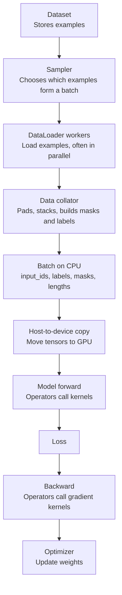
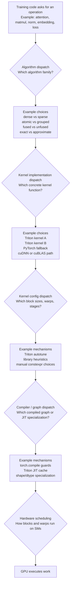
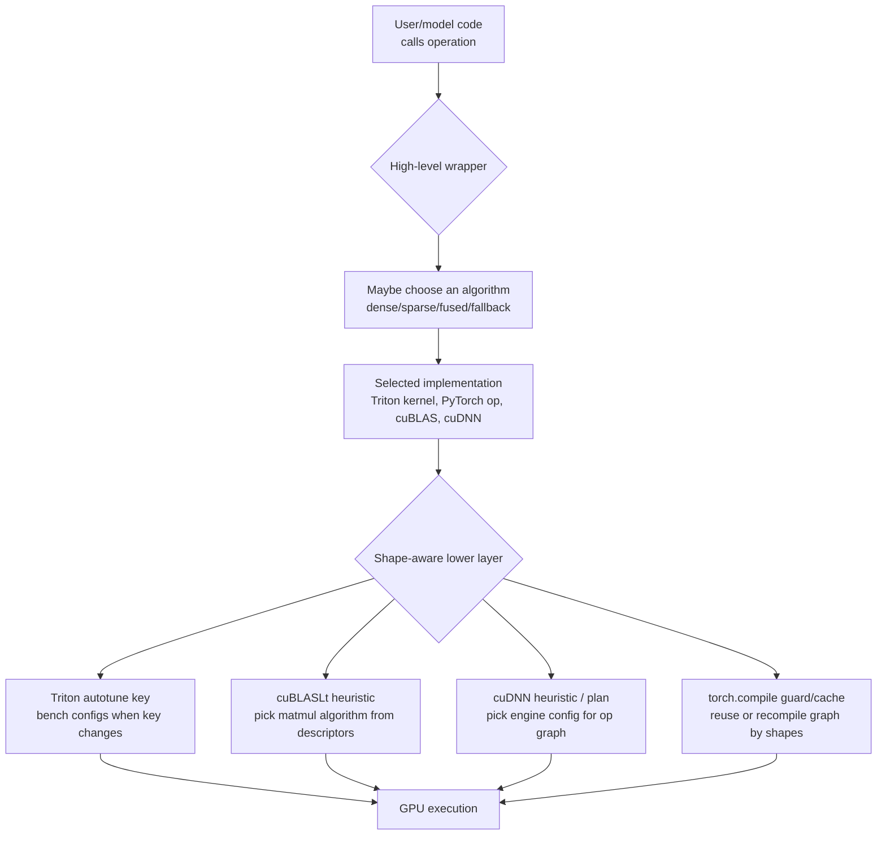
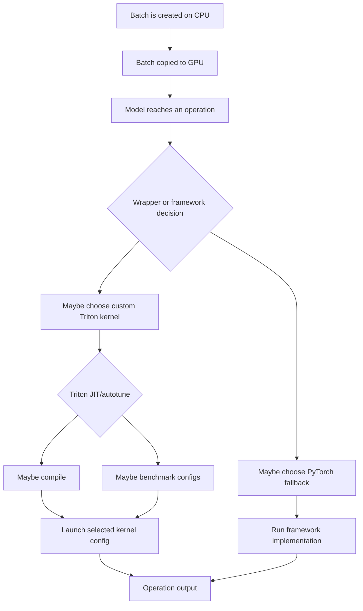
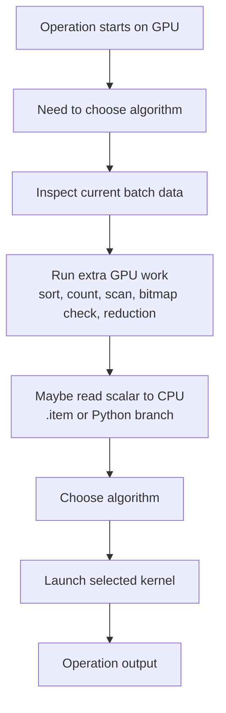
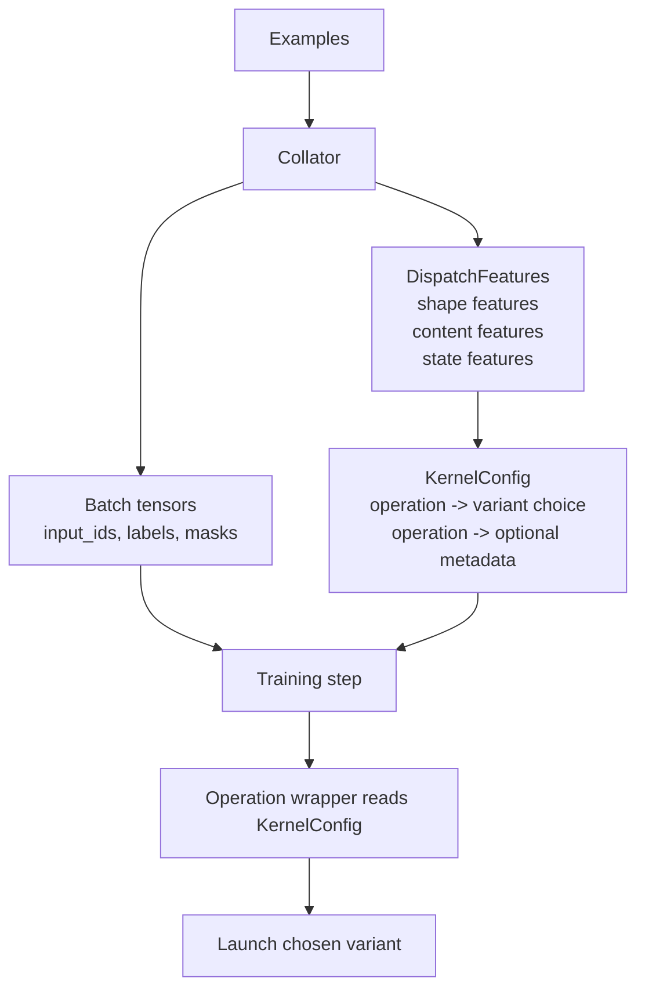

# Stateful Data-Dependent Kernel Dispatch

This note is not an implementation plan yet. It is a system model for
understanding what "dispatch" means in a training stack, which variables are in
play, where decisions happen today, and what problem we are actually trying to
target.

The central question:

```text
When an operation has more than one valid implementation, who chooses the
implementation, using what information, at what time, and at what cost?
```

The proposed idea is only about one part of that larger dispatch system. It is
not trying to replace Triton autotune, PyTorch compilation, cuDNN heuristics, or
GPU scheduling. It is trying to move a specific class of decisions earlier:

```text
Late, blocking, data-dependent algorithm choices
    -> early, overlapped, explicit batch metadata choices
```

## The Current Training System

At a high level, a training step is a pipeline:



Each box has inputs, work, and outputs:

| Stage | Input | Process | Output |
| --- | --- | --- | --- |
| Dataset | Stored examples | Return examples | One or more examples |
| Sampler | Dataset indices | Choose batch composition | Example indices |
| DataLoader workers | Example indices | Fetch examples in CPU processes | List of examples |
| Data collator | List of examples | Pad, stack, mask, label | CPU batch tensors |
| Device copy | CPU tensors | Copy to GPU | GPU batch tensors |
| Model forward | GPU batch tensors | Run model operators | Activations/logits |
| Loss | Logits and labels | Compute objective | Loss tensor |
| Backward | Loss and saved activations | Compute gradients | Parameter gradients |
| Optimizer | Gradients | Update parameters | New weights |

The important observation: the collator is early and CPU-side. Kernels are late
and GPU-side.

## What Dispatch Means

"Dispatch" means choosing among alternatives. In a training system there are
several different kinds of dispatch. They are related, but they are not the
same problem.

### Dispatch Stack



The proposed idea mostly targets the first two levels:

```text
Algorithm dispatch and kernel implementation dispatch.
```

It does not primarily target:

```text
Triton block-size autotuning,
PyTorch graph dispatch,
cuDNN/cuBLAS internal heuristics,
or GPU warp scheduling.
```

Those lower-level systems can still exist underneath the proposed design.

## The Triton Autotune Confusion

This is a key distinction.

With `@triton.autotune`, Triton may benchmark several configurations for the
same kernel function. For example:

```text
same algorithm, same kernel code:
    try BLOCK_M=32, BLOCK_N=128, num_warps=4
    try BLOCK_M=64, BLOCK_N=128, num_warps=4
    try BLOCK_M=64, BLOCK_N=256, num_warps=8
    pick the fastest config for this autotune key
```

That is config dispatch. It answers:

```text
For this one kernel algorithm, which launch/config parameters are fastest?
```

The proposed collator-stage idea answers a different question:

```text
For this batch's data pattern, which algorithm or kernel variant should we use?
```

The difference:

| Question | Example | System that usually handles it | Is this proposal targeting it? |
| --- | --- | --- | --- |
| Which algorithm family? | Dense attention or sparse attention? Atomic update or grouped reduction? | Usually handwritten Python/runtime logic | Yes |
| Which kernel implementation? | Custom Triton path or PyTorch fallback? | Wrapper code / framework dispatch | Yes |
| Which block size? | 64x128 or 128x128 tile? | Triton autotune / library heuristics | Mostly no |
| Which compiled graph? | Reuse compiled graph or recompile? | `torch.compile`, JIT guards | Mostly no |
| Which SM runs a block? | Hardware scheduling | GPU runtime/hardware | No |

Triton autotune can run candidate configs before choosing the best config. That
is expected and useful. We are not trying to remove it in v1.

However, the proposed system can still interact with autotune:

- if we know likely variants early, we can warm them before real training,
- if we know likely shapes/buckets early, we can warm those autotune keys,
- if we reduce the number of algorithm variants, we reduce compile/cache churn,
- but each selected kernel variant may still use Triton autotune internally.

## Shape Dispatch: Where It Lives

The sentence "existing systems already dispatch well on shape" does not mean
every project has a visible top-level `if shape -> kernel` abstraction.

It usually means that shape information flows into lower layers, and those
layers choose implementations, configs, compiled graphs, or cached plans.



So there are two very different meanings of "shape dispatch":

| Meaning | Example | Where it happens |
| --- | --- | --- |
| Algorithm-level shape dispatch | If sequence length is short, use one algorithm; if long, use another. | Usually explicit wrapper/model code. |
| Config/library shape dispatch | For the same algorithm, choose tile size, warps, engine, algorithm id, or compiled graph. | Triton, cuBLASLt, cuDNN, `torch.compile`, library caches. |

Our proposed collator idea is mainly about algorithm-level or
implementation-level dispatch. Triton/cuBLAS/cuDNN shape dispatch is lower
level and still useful after the algorithm has already been chosen.

## Does Forge Do Shape Dispatch?

Yes, but mostly inside individual kernels. Forge does not currently appear to
have a single global dispatcher that says:

```text
for operation X and batch shape/content Y, choose algorithm family Z
```

Instead, Forge uses per-kernel shape/config choices:

| Forge area | What shape/config decision exists? | What level is it? |
| --- | --- | --- |
| SwiGLU | `_calculate_settings(n_cols)` rounds hidden width to a power-of-two block size and chooses `num_warps` by width bucket. | Manual kernel config dispatch. |
| RMSNorm v3/v4 | Triton autotunes `num_warps`/`num_stages` with key `["n_cols", "ACC_DTYPE"]`. | Triton config dispatch. |
| LoRA MLP v1/v2 | Triton autotunes matmul tile configs with keys such as `["M", "N", "K", "HAS_LORA", "FP32_PRECISE"]`. | Triton config dispatch. |
| Embedding forward | Triton autotunes block sizes with key `["n_elements", "embedding_dim"]`. | Triton config dispatch. |
| Some later POCs | Fixed `BLOCK_M`/`BLOCK_N` choices such as `64 x 64`. | Manual fixed config. |

This means Forge already uses shape in the lower layers.

What Forge is mostly not doing yet is a systematic, cross-kernel, batch-aware
algorithm dispatch layer:

```text
batch features -> operation-specific policy -> selected algorithm/kernel variant
```

That is the part this proposal is exploring.

## How The Other Systems Use Shape

These systems are lower in the stack than the proposed collator dispatcher.

| System | What input does it see? | What does it choose? | User-visible behavior |
| --- | --- | --- | --- |
| Triton autotune | Kernel arguments named in the autotune key, often shape/dtype constants. | Best config from a list: block sizes, warps, stages. | First call for a new key may run multiple configs; later calls reuse the winner. |
| cuBLASLt | Matmul descriptors: M/N/K, layouts, dtypes, transpose flags, epilogue, workspace preference. | Matmul algorithm descriptor. | User calls matmul/linear; library/PyTorch picks a GEMM algorithm internally. |
| cuDNN | Operation graph/tensor descriptors: shape, layout, dtype, operation pattern. | Engine config / execution plan. | User calls conv/norm/fused graph; cuDNN plan selects an engine. |
| `torch.compile` | Python graph plus tensor metadata and guards. | Reuse compiled graph or recompile / generalize dynamic shapes. | User sees first-compile cost and possible recompiles when shapes/control flow differ. |

How this reflects to a user:

- In plain PyTorch, `torch.matmul` or `nn.Linear` may internally reach cuBLAS or
  cuBLASLt. You normally do not manually pick the exact GEMM kernel.
- In cuDNN-backed ops, PyTorch or another framework may build descriptors and
  query cuDNN plans. You normally just call the high-level op.
- In Triton code, the kernel author writes the config list and key. The user may
  only notice first-call autotune latency and better later performance.
- In `torch.compile`, the user may notice compile time, graph breaks, or
  recompiles when shapes change.

Forge uses Triton directly for its custom POC kernels, so Forge authors control
the Triton config lists, keys, and manual shape heuristics. Forge may also use
PyTorch ops around custom kernels; those surrounding PyTorch ops may use cuBLAS,
cuBLASLt, or other backend dispatch internally. Forge's custom Triton kernels do
not automatically get cuDNN/cuBLAS heuristic dispatch unless they call into
PyTorch/library matmul or a direct wrapper.

## Variables In The System

A dispatch decision can depend on many variables. The most important thing is
not just the variable itself, but when it becomes known.

### Static Variables

Known before training starts:

| Variable | Examples | Who knows it early? |
| --- | --- | --- |
| Hardware | A100, H100, L4, memory size, SM count | Training launcher |
| Dtype | fp32, fp16, bf16 | Model/training config |
| Model dimensions | hidden size, head dim, vocab size, number of heads | Model config |
| Max sequence length | 2048, 4096, 8192 | Training config |
| Kernel availability | Which custom kernels are installed | Runtime/import system |

These are usually good inputs for compile, warmup, and shape bucketing.

### Batch Shape Variables

Known when the batch is formed:

| Variable | Examples |
| --- | --- |
| Batch size | Number of sequences or packed samples |
| Sequence length | Padded length or packed token count |
| Number of tokens | Total tokens in batch |
| Padding ratio | How much of the tensor is padding |
| Shape bucket | Short, medium, long sequence bucket |
| Tensor layout | Contiguous, packed, ragged, blocked |

Many existing systems already dispatch well on shape. This is the common case
for Triton autotune, cuDNN heuristics, cuBLAS heuristics, and compiled graph
caches.

### Batch Content Variables

Known from the actual batch values, before the model runs:

| Variable | Examples | Known in collator? |
| --- | --- | --- |
| Token frequency distribution | How often each token ID appears | Yes, if token IDs are present |
| Duplicate ratio | Unique tokens / total tokens | Yes |
| Max duplicate group size | Largest repeated-token count | Yes |
| Padding mask density | Fraction of real tokens vs padding | Yes |
| Block mask density | Which attention blocks are legal from masks/document boundaries | Often yes |
| Label ignore density | How many labels are `ignore_index` | Yes |
| Sequence length distribution | Long/short examples inside the batch | Yes |

These are the variables the proposed idea is most interested in.

### Activation-Dependent Variables

Only known after part of the model has run:

| Variable | Example | Known in collator? |
| --- | --- | --- |
| Actual QK attention scores | Which tokens attend strongly after query/key projection | No |
| Router decisions in MoE | Which expert each token is sent to | No, unless routing is precomputed |
| Activation sparsity | Which activations are zero/small after layers | No |
| Gradient magnitude distribution | Which gradients are large/small | No |

These are weaker candidates for collator-stage dispatch. They may still be
useful for runtime dispatch, but they cannot be exactly selected before the
forward pass unless a predictor or approximation is used.

### Runtime State Variables

Known as training progresses:

| Variable | Example |
| --- | --- |
| Recent batch history | Last N batches were mostly sparse/high-duplication/long |
| Kernel compile cache | Which Triton specializations are already compiled |
| Autotune cache | Which configs have already been benchmarked |
| Graph cache | Which compiled graphs are reusable |
| DataLoader backlog | Whether CPU workers are keeping up with GPU |

Statefulness means using these variables instead of treating every batch as an
isolated event.

## Where Decisions Happen Today

Current systems often look like this:



This works well for many operations. The problem appears when the wrapper
decision needs data-content features and computes them late.

Late content-dependent dispatch can look like:



The issue is not the existence of dispatch. The issue is dispatch work sitting
on the critical path of the training step.

## What Is The Critical Path?

The critical path is the chain of work that directly determines step time.

If CPU workers are preparing batch `t + 1` while the GPU trains batch `t`, that
CPU work can be hidden.

```mermaid
gantt
  title Useful Overlap
  dateFormat X
  axisFormat %s

  section CPU
  Prepare next batch     :cpu1, 0, 6

  section GPU
  Train current batch    :gpu1, 0, 10
```



Here, CPU preparation finishes before the GPU needs the next batch. It does not
increase step time.

But if a decision happens after the GPU step has already reached the operation,
it is on the critical path:

```mermaid
gantt
  title Late Dispatch On Critical Path
  dateFormat X
  axisFormat %s

  section GPU
  Forward and other backward      :g1, 0, 8
  Inspect data for dispatch       :crit, g2, 8, 10
  Run selected kernel             :crit, g3, 10, 13
  Optimizer                       :g4, 13, 14
```



The proposed idea tries to move the inspection earlier:

```mermaid
gantt
  title Early Dispatch With Overlap
  dateFormat X
  axisFormat %s

  section CPU
  Collate next batch              :c1, 0, 4
  Compute dispatch features       :c2, 4, 6
  Build KernelConfig              :c3, 6, 7

  section GPU
  Forward and other backward      :g1, 0, 8
  Run preselected kernel          :crit, g2, 8, 11
  Optimizer                       :g3, 11, 12
```



The expected win only exists if:

```text
CPU feature work is cheaper than the available overlap window,
and the selected kernel avoids enough late GPU inspection or sync cost.
```

## The Problem We Are Targeting

The target problem is not "dispatch is slow" in general.

The target problem is narrower:

```text
Some kernels need data-content-aware algorithm selection.
Today, the data-content features may be computed inside the training step,
after tensors are already on GPU.
That can add GPU work, CPU/GPU synchronization, compile/autotune stalls, or
wrong-path overhead to the critical path.
But some of those features were already knowable when the batch was collated.
```

The proposed system asks:

```text
Can we compute those features earlier, attach them to the batch, and let the
model use an explicit KernelConfig instead of rediscovering the same facts late?
```

## What We Are Not Targeting

This is important for scope.

We are not trying to replace:

- Triton autotune for block sizes and num warps,
- cuDNN or cuBLAS internal heuristic selection,
- PyTorch's graph/compiler cache,
- GPU scheduling,
- every Python `if` statement around kernels,
- runtime decisions based on values that only exist after forward/backward.

Those systems may remain exactly as they are.

The proposed idea sits above them:

```text
Collator selects algorithm family or kernel variant.
Selected variant may still use Triton autotune internally.
Selected variant may still be JIT-compiled and cached.
Selected variant may still be part of a compiled graph if the integration allows it.
```

## Candidate Audit

This section decides which operations are worth targeting with collator-stage
dispatch.

"Rejected" here does not mean the kernel is unimportant. It means this specific
idea is probably the wrong lever. A rejected operation can still be a good target
for Triton autotune, fusion, memory reduction, or library-backed optimization.

Research context:

- Triton autotune already handles config selection: configs are re-evaluated
  when the autotune key changes, and the kernel may run multiple times during
  tuning. That is lower-level config dispatch, not the algorithm-level dispatch
  considered here. Source: [Triton autotune docs](https://triton-lang.org/main/python-api/generated/triton.autotune.html).
- PyTorch SDPA already dispatches among FlashAttention-2, memory-efficient
  attention, and a C++ math implementation based on inputs and backend support.
  Source: [PyTorch SDPA docs](https://docs.pytorch.org/docs/2.12/generated/torch.nn.functional.scaled_dot_product_attention.html).
- DataLoader already supports `collate_fn`, multiple workers, prefetching, and
  persistent workers. That is the overlap window this proposal wants to use.
  Source: [PyTorch DataLoader docs](https://docs.pytorch.org/docs/2.12/data.html).
- `torch.compile` can recompile on guard failures such as shape mismatches; this
  matters when dispatch metadata creates too many graph variants. Source:
  [PyTorch recompilation docs](https://docs.pytorch.org/docs/stable/user_guide/torch_compiler/compile/programming_model.recompilation.html).
- Sparse/irregular GPU work has strong precedent for feature-based selection:
  Seer predicts the best SpMV strategy from dataset features and reports a 2x
  improvement over the best single kernel across SuiteSparse. Source:
  [Seer paper](https://arxiv.org/abs/2403.17017).
- Training data pipelines already expose useful batch metadata. TRL's SFT
  collator supports packing, padding-free mode, and completion/assistant-only
  labels where non-loss tokens are set to `-100`. Source:
  [TRL SFT docs](https://huggingface.co/docs/trl/v0.26.0/en/sft_trainer).

Local Forge surfaces checked:

| Kernel family | Local status | Dispatch-audit implication |
| --- | --- | --- |
| Embedding | Wired through `forge.patch(model, kernels=["embedding"])`. | Best first exact POC because model wiring already exists. |
| RMSNorm | Wired through `forge.patch` for Qwen/Gemma RMSNorm modules. | Useful as a reject example: lots of kernel variants, no collator content signal. |
| SwiGLU | Wired for Qwen-style MLP activation boundary. | Useful as a reject example: architecture/static dispatch, not batch-content dispatch. |
| RoPE | Wired by monkey-patching the module-level HF RoPE function. | Useful as a reject example with many real variants that are shape/static, not content. |
| LayerNorm | Exported for direct callers; Qwen/Gemma use RMSNorm, so not in their mappings. | Static trainable-vs-frozen variant exists, but not collator-driven. |
| Cross entropy / fused linear CE | Exported package surface exists; patching stub says model/loss interception is not wired. | Strong candidate, but integration work is needed before end-to-end testing. |
| GEGLU | POC exists for Gemma activation/MLP helper; patching currently marks it unbuilt. | Variant choice is architecture/static, not collator-driven. |
| LoRA MLP | POC/export exists; PEFT integration deferred and patching stub raises if requested. | Useful for shape/static dispatch, not content dispatch. |
| LoRA QKV | POC exists under `kernels/lora_qkv`; patching stub says not built. | Same as LoRA MLP; not a collator-content candidate. |

### Acceptance Gates

A candidate must pass these gates before we build anything:

| Gate | Question | Pass signal | Fail signal |
| --- | --- | --- | --- |
| Variant gate | Are there multiple correct algorithms or kernel variants? | Dense vs sparse, padded vs packed, atomic vs grouped, compacted vs full. | Only one sensible implementation exists. |
| Feature gate | Is the deciding feature known before the operation runs? | Token IDs, labels, masks, sequence lengths, document boundaries. | Feature depends on QK scores, router outputs, activations, or gradients. |
| Cost gate | Is the current decision or wasted work on the critical path? | GPU sort/count/scan, `.item()` sync, large padded compute, first-use compile stalls. | Existing lower layer already handles it cheaply. |
| Overlap gate | Can feature computation fit inside DataLoader/collator overlap? | CPU stats are cheap relative to GPU step; metadata is small. | CPU sort/format conversion makes DataLoader the bottleneck. |
| Correctness gate | Does choosing a variant preserve semantics? | Variants are exact or explicitly approximate with acceptable policy. | Sparse/approximate choice can silently change model behavior. |
| Integration gate | Can this be passed without breaking compile/graph/distributed behavior? | Small tensor metadata or stable bucket IDs. | Python config causes graph breaks or too many graph variants. |

The strongest candidates pass all six gates.

### Collator Baseline Vs Proposed Delta

This proposal should not pretend that the collator is empty today. Most training
pipelines already use the collator to build the batch representation.

Current normal collator responsibilities:

| Already done during collation | Output today | Why it matters |
| --- | --- | --- |
| Pad examples to a common length | `input_ids`, `attention_mask`, sometimes `position_ids` | Sequence length and padding ratio are already visible. |
| Stack examples into tensors | Batch tensors | Batch size, token count, and shape bucket are already visible. |
| Build labels | `labels` | Active labels and ignored labels are already visible. |
| Apply loss masking | `labels == -100` or `ignore_index` positions | Completion-only / assistant-only loss sparsity is already visible. |
| Optional packing | Packed examples, sequence boundaries, position IDs | Document boundaries and ragged/varlen metadata may already exist. |
| Optional task-specific masks | Attention masks, block masks, segment IDs | Structural sparsity may already exist. |

The proposed delta is not "make the collator do everything." The delta is:

```text
existing batch facts
    -> explicit DispatchFeatures
    -> policy decision
    -> KernelConfig / metadata passed to the model
```

| Proposed delta | New output | When it is worth doing | When it is not worth doing |
| --- | --- | --- | --- |
| Summarize existing facts | `DispatchFeatures` such as padding ratio, active-label ratio, duplicate ratio | Feature is cheap to compute from tensors already in CPU memory. | Feature requires an expensive CPU scan/sort and the GPU path is already cheap. |
| Choose policy early | `KernelConfig` such as `loss_variant=active_tokens` | Multiple variants exist and the choice avoids real critical-path work. | One variant dominates or choice is already handled by a lower layer. |
| Build reusable metadata | active token indices, varlen `cu_seqlens`, block masks, token groups | Metadata replaces late GPU inspection or enables less work. | Metadata copy/construction costs more than the saved kernel work. |
| Warm likely variants | compile/autotune keys for likely buckets | First-call compile/autotune is visible in step time. | Shapes are too diverse or warmup memory/time is too high. |
| Track cross-batch state | recent bucket/variant history | Batch stream has patterns and state improves warmup/prediction. | Batches are random, workers are hard to coordinate, or state causes graph churn. |

So every candidate should be read in two parts:

```text
What is already known in the collator?
What extra delta would we add, and why would that reduce critical-path work?
```

### Verdict Summary

| Candidate | Verdict | Already known/done in collator | Proposed delta |
| --- | --- | --- | --- |
| Padding/packing/varlen sequence dispatch | Existing established lever; accept as integration/supporting case | Lengths, masks, padding, sometimes packed boundaries. | Emit/reuse varlen metadata and choose or preselect padded vs varlen path only when the stack does not already do this well. |
| Label sparsity / ignored-token loss dispatch | Strong accept for SFT-style losses | Labels and `ignore_index`/`-100` positions. | Emit active-token indices/counts and choose full vs active-token loss path. |
| Embedding backward duplicate-aware dispatch | Strong accept | `input_ids` are present; duplicates are computable. | Emit duplicate stats or grouping metadata and choose scatter/grouped/cooperative path. |
| Static/block-mask sparse attention | Accept when sparsity is mask-defined | Attention masks, segment IDs, document boundaries if already built. | Emit block mask density/layout and choose dense vs structural sparse attention. |
| Sparse/ragged external data ops | Accept for graph/retrieval/recsys-style batches | Sparse IDs, ragged lengths, nonzero structure if data is sparse. | Emit sparse-format features and choose sparse format/kernel. |
| Shape-bucket warmup / compile-key prewarming | Supporting candidate | Batch shapes and upcoming sampler buckets. | Prewarm likely compile/autotune keys before the critical path. |
| MoE expert routing dispatch | Conditional / mostly reject for collator | Dataset examples only; learned expert IDs are not known. | At most predict/warm likely paths; exact routing remains runtime. |
| Dense matmul / linear projections | Reject for collator dispatch | Shapes are known. | No useful content delta; leave config choice to cuBLAS/Triton/autotune. |
| RMSNorm / LayerNorm | Reject for collator dispatch | Shapes/dtypes are known. | No useful content delta; optimize by config/fusion/in-place. |
| SwiGLU / GeGLU / elementwise activations | Reject for collator dispatch | Shapes/dtypes are known. | No useful content delta; optimize by fusion/config. |
| RoPE | Reject for collator dispatch | Position IDs may be known. | No meaningful algorithm choice from batch content. |
| QK-score sparse attention | Reject for exact collator dispatch | Masks may be known, but QK scores are not. | Only structural sparsity belongs in collator; score sparsity is runtime. |
| Dense optimizer kernels | Reject for collator dispatch | Nothing about gradients is known. | No collator delta; optimizer sees gradients after backward. |

### Kernel-Family Variant Map

The table below separates four things that are often mixed together:

```text
algorithm variant:
    a different way to compute the operation

implementation variant:
    a different kernel or fusion boundary for the same math

config variant:
    different block size, num_warps, num_stages, tile shape

static model variant:
    a choice fixed by model architecture or training setup
```

Collator-stage dispatch is most useful for algorithm or implementation variants
whose deciding feature is visible in the batch before the operation runs.

| Kernel family | Variants that exist | Does variant choice depend on batch content? | Collator-stage verdict |
| --- | --- | --- | --- |
| Embedding backward | Atomic/index-add scatter, sort/group reduction, cooperative grouped reduction, possible sparse optimizer handoff. | Yes. Token duplicate distribution changes the best accumulation strategy. | Accept. |
| Cross entropy / fused linear CE | Standalone CE, chunked fused linear+CE, ignore-index skip, active-token compaction, label smoothing/weighted/softcap/z-loss variants. | Sometimes. `ignore_index` density is batch content; label smoothing/weights/softcap are static config. | Accept for ignored-label/active-token regimes. |
| Padding/packing/varlen attention path | Padded dense attention, varlen FlashAttention-style path, padding-free packed path, structural block-sparse path. | Yes for padding/mask structure; no for QK-score sparsity. | Already done in many stacks; accept as integration/supporting case, not core novelty. |
| RoPE | Separate Q/K launches, fused Q+K, GQA-grouped fused Q+K, split-half vs interleaved/complex, precomputed cos/sin vs in-kernel sincos, in-place vs out-of-place. | No for token content. Choices depend on model layout, GQA shape, position encoding convention, and safety policy. | Reject for content dispatch; keep as shape/static-kernel optimization. |
| RMSNorm | Llama/Qwen vs Gemma offset, casting mode, in-place backward, dW partial strategy, autotuned warps/stages. | No. Depends on model architecture, dtype, hidden size, and whether parameters train. | Reject for collator dispatch. |
| LayerNorm | Liger-style full gradients, Unsloth-style frozen affine/no dW-dB, in-place dY-to-dX, Welford vs two-pass variance, partial reduction strategy. | Mostly no. Frozen affine is training/module state, not batch content. | Reject for collator dispatch; possible static module policy. |
| SwiGLU | Separate gate/up tensors, packed gate_up tensor, multiplier support, preserve-input vs in-place backward, row-wise vs flat launch. | No. Shapes and architecture decide variants. | Reject for collator dispatch. |
| GEGLU | Exact vs tanh GELU, separate vs packed gate_up, activation-only vs gate+up MLP helper, flat vs row launch, preserve-input policy. | No. Approximation is model/config choice; shape affects performance. | Reject for collator dispatch. |
| LoRA MLP | Unfused cuBLAS calls, fused LoRA matmul, cuBLAS base + Triton epilogue, gate+up packing, recompute vs save, rank-specialized paths. | No for batch content. Depends on rank, hidden/intermediate sizes, adapter presence, quantization. | Reject for collator dispatch; use static config and shape warmup. |
| LoRA QKV | Per-projection LoRA, fused QKV, packed Q/K/V weights, cuBLAS + epilogue, GQA-aware output dimensions. | No for batch content. Depends on rank, GQA shape, projection dimensions. | Reject for collator dispatch; use static model/shape dispatch. |
| MoE routing | AllGather vs AllToAll token dispatcher, token sorting/permutation, grouped GEMM, padded capacity vs dropless/block-sparse execution. | Yes, but the content is hidden-state/router output, not collator data. | Reject for exact collator dispatch; accept runtime dispatch/prediction/warmup. |
| Sparse/ragged data ops | CSR/COO/ELL/block sparse formats, dense fallback, row-split strategies, load-balance variants. | Yes if sparsity is present in the input data. | Accept if Forge targets sparse external workloads. |
| Dense matmul/linear | cuBLAS/cuBLASLt algorithm, Triton tile configs, epilogues, quantized/static adapter paths. | No. Values do not choose the dense GEMM algorithm. | Reject for collator dispatch. |
| Dense optimizer | Fused AdamW, multi-tensor apply, dense per-parameter update, sparse embedding update exception. | No for collator; gradients are unknown until backward. | Reject except downstream of sparse/embedding gradients. |

#### Embedding Backward

Algorithm variants:

- simple scatter/index-add,
- atomic-add style scatter,
- sort token IDs then reduce each token group,
- cooperative grouped reduction for very large duplicate groups,
- possible sparse-gradient or sparse-optimizer handoff.

Content dependency:

- Strong. The best path depends on `n_tokens`, `n_unique`, duplicate ratio, and
  max duplicate group size.
- These are exact properties of `input_ids`, so the collator can compute them.

Already done in the collator:

- `input_ids` are padded/stacked.
- Padding token placement is often visible.

Proposed delta:

- compute duplicate stats,
- optionally build token grouping metadata,
- emit `KernelConfig.embedding_backward = simple | grouped | cooperative`.

Why accepted:

- This is a real content-dependent algorithm choice.
- It can avoid late sorting/counting/sync if the current kernel computes those
  features at runtime.

When rejected:

- mostly unique-token batches,
- tiny batches,
- CPU grouping is slower than GPU grouping,
- metadata copy dominates,
- embedding backward is not a material fraction of step time.

#### Cross Entropy And Fused Linear Cross Entropy

Algorithm/implementation variants:

- standalone CE over already-materialized logits,
- fused linear+CE that chunks the vocabulary projection and avoids materializing
  full `B*T*V` logits,
- ignored-token skip inside CE,
- active-token compaction before CE or fused linear+CE,
- feature variants: class weights, label smoothing, z-loss, softcap, token
  accuracy, predicted tokens.

Content dependency:

- Sometimes.
- `ignore_index` density is batch content and is known from labels.
- Label smoothing, class weights, softcap, and z-loss are static training config.
- Predicted tokens and token accuracy require logits, so those are not known in
  the collator.

Already done in the collator:

- labels are built,
- padding/prompt/user/system tokens may be set to `-100`,
- completion-only or assistant-only masks are created by the data pipeline.

Proposed delta:

- compute active-label count and active-token positions,
- choose full CE vs ignored-label CE vs active-token compacted fused linear+CE,
- optionally pass compacted active row indices.

Why accepted:

- In SFT, many tokens may not contribute to the loss.
- PyTorch CE explicitly ignores `ignore_index`, and TRL SFT uses masking for
  padding and completion/assistant-only loss.
- Forge already has fused linear+CE experiments, where avoiding work before the
  CE boundary could matter more than optimizing standalone CE.

When rejected:

- standard causal LM with almost every token active,
- label smoothing or probability targets force dense per-class semantics,
- active-token compaction breaks downstream shape assumptions,
- current kernel already skips ignored labels and full-logit projection is not
  the bottleneck,
- active row metadata increases graph/compile variants too much.

#### Padding, Packing, Varlen, And Structural Attention

Algorithm/implementation variants:

- padded dense attention,
- PyTorch SDPA-selected backend: FlashAttention-2, memory-efficient attention,
  or math implementation,
- varlen FlashAttention-style path using sequence lengths / cumulative lengths,
- padding-free packed path,
- structural block-sparse attention from masks/document boundaries/local windows.

Content dependency:

- Yes for batch structure: sequence lengths, padding ratio, document boundaries,
  segment masks, block masks.
- No for actual attention-score sparsity, because QK scores exist only after Q
  and K are computed.

Already done in the collator:

- padding and attention masks,
- sometimes sequence packing,
- sometimes position IDs and document boundaries.

Proposed delta:

- emit varlen metadata such as cumulative sequence lengths,
- emit block-mask density/layout,
- choose padded dense vs varlen vs structural sparse path.

Why accepted:

- Padding can waste a large fraction of attention and MLP work.
- The collator controls the batch representation.
- PyTorch SDPA already proves attention has multiple valid backend choices, but
  it does not know higher-level packing policy unless the model passes the right
  representation.

When rejected:

- low padding because batches are length-bucketed,
- fixed-shape CUDA graph or compile setup needs stable padded shapes,
- masks are dense or not block-structured,
- sparse/varlen metadata conversion costs more than the saved compute,
- no compatible attention kernel is wired into Forge.

#### RoPE

Algorithm/implementation variants:

- apply RoPE to Q and K separately,
- fuse Q and K in one launch,
- group Q heads by KV head for GQA,
- split-half rotation, interleaved rotation, or complex-number formulation,
- precomputed cos/sin passed in vs in-kernel sin/cos,
- in-place vs out-of-place output,
- Triton autotuned warps/configs.

Content dependency:

- No. RoPE output depends on positions and model convention, not token IDs,
  labels, padding density, or token frequency.
- Packed/varlen batches may change `position_ids` or RoPE indices, but that is
  metadata correctness, not content-dependent algorithm selection.

Already done in the collator:

- sometimes position IDs,
- sometimes packed sequence boundaries.

Proposed delta:

- pass correct position/packing metadata if the model uses packed sequences,
- maybe warm the GQA/fused kernel for known head/sequence buckets.

Why rejected for this proposal:

- RoPE variants are chosen by static model layout and shape:
  `n_q`, `n_kv`, `head_dim`, split-half vs interleaved, and in-place safety.
- The collator does not reveal a new content fact that changes the RoPE
  algorithm.

When it might look related but is not:

- If the collator packs multiple documents, RoPE must reset or adjust positions.
  That is a correctness requirement for packing.
- If sequence length buckets differ, warmup can help compile/autotune. That is
  shape warmup, not content dispatch.

Verdict:

```text
Great kernel optimization target.
Bad collator-stage content-dispatch target.
```

#### RMSNorm

Algorithm/implementation variants:

- Llama/Qwen style `weight` vs Gemma-style `weight + 1` offset,
- casting modes for numerical parity,
- forward row-wise reduction with power-of-two block size,
- backward with per-SM partial `dW` reduction,
- in-place `dY -> dX` backward when safe,
- Triton autotune over `num_warps` and `num_stages`.

Content dependency:

- No. The same number of elements and reductions happen regardless of token
  values, labels, or padding identity.
- Hidden size, dtype, offset mode, and trainability drive the useful variants.

Already done in the collator:

- nothing relevant beyond shape.

Proposed delta:

- none for content dispatch.
- shape-bucket warmup may precompile/autotune common hidden sizes, but hidden
  size is usually static per model anyway.

Why rejected:

- Forge already handles shape/config through manual heuristics and autotune.
- Data-content features do not change the algorithm.

Sometimes:

- If RMSNorm weights are frozen, an in-place/no-parameter-gradient path can be
  selected. That should be a module/training-state decision, not a per-batch
  collator decision.

#### LayerNorm

Algorithm/implementation variants:

- full-gradient Liger-style path that computes `dX`, `dW`, and `dB`,
- Unsloth-style path for frozen affine parameters that computes only `dX`,
- in-place `dY -> dX` backward,
- Welford vs two-pass variance strategy,
- partial-buffer vs atomic parameter-gradient reduction,
- fp32 vs fp64 accumulators for gradcheck/precision.

Content dependency:

- Mostly no.
- The input values determine the mean/variance numerically, but we do not choose
  a different algorithm from those values in a safe useful way.

Already done in the collator:

- nothing relevant beyond batch shape.

Proposed delta:

- none for content dispatch.
- static policy can choose full-gradient vs frozen-affine variant based on
  whether `weight`/`bias` require gradients.

Why rejected:

- The meaningful variant choice is module state, not batch content.
- Runtime values are activations, not collator-visible data.

Sometimes:

- If a training regime freezes all norms, select the no-`dW`/`dB` variant
  globally.
- If norms are trainable, do not use the frozen variant even if it is faster.

#### SwiGLU And GEGLU

Algorithm/implementation variants:

- activation type: SiLU for SwiGLU, GELU exact or tanh approximation for GEGLU,
- separate `gate` and `up` tensors vs packed `gate_up`,
- activation-only kernel vs larger MLP helper,
- row-wise launch vs flattened elementwise launch,
- in-place backward vs preserve-input backward,
- optional scalar multipliers,
- potential recompute-vs-save policy around MLP intermediates.

Content dependency:

- No. The same elementwise work happens for every token.
- Approximation mode is model/config-defined, not batch-defined.
- Packed vs separate is determined by upstream projection layout, not token
  content.

Already done in the collator:

- nothing relevant beyond batch shape.

Proposed delta:

- none for content dispatch.
- maybe shape warmup for token-count buckets, but that is secondary.

Why rejected:

- These are regular dense elementwise kernels.
- The right optimizations are fusion boundary, memory traffic, in-place policy,
  block sizing, and dtype behavior.

Sometimes:

- Tiny decode-like shapes vs large training shapes may prefer different launch
  geometry. That is shape/config dispatch inside the kernel wrapper, not
  collator content dispatch.
- Gemma uses GEGLU while Qwen/Llama use SwiGLU. That is architecture dispatch in
  `forge.patch`, not batch dispatch.

#### LoRA MLP And LoRA QKV

Algorithm/implementation variants:

- unfused PyTorch/cuBLAS sequence,
- fused LoRA matmul in Triton,
- cuBLAS base matmul plus Triton LoRA epilogue,
- packed gate+up or QKV projections,
- recompute vs save intermediates,
- rank-specialized tile shapes,
- quantized-weight-aware path,
- GQA-aware QKV output dimensions.

Content dependency:

- No for ordinary dense LoRA.
- The deciding variables are LoRA rank, hidden size, intermediate size, number of
  heads, number of KV heads, quantization, adapter presence, and trainability.

Already done in the collator:

- nothing relevant beyond token count / shape.

Proposed delta:

- shape-bucket warmup for common `B*S`,
- maybe static policy based on rank/quantization/adapters.

Why rejected:

- The collator does not know anything that changes the dense LoRA algorithm.
- cuBLAS and Triton autotune are already the right mechanisms for tile/config
  choices.

Sometimes:

- If a batch is extremely small, launch overhead may make an unfused/library path
  better than a custom fused path. That is shape dispatch.
- If adapters are disabled or rank is zero, skip LoRA work. That is static model
  state, not batch content.

#### MoE Routing

Algorithm/implementation variants:

- all-gather token dispatch,
- all-to-all token dispatch,
- DeepEP/hybrid dispatcher,
- token permutation/sort by expert,
- grouped GEMM by expert,
- padded-capacity vs dropless/block-sparse expert execution.

Content dependency:

- Yes, but not collator-visible for normal learned MoE.
- The routing map is produced by the router from hidden states during forward.

Already done in the collator:

- dataset examples only; no expert assignment.

Proposed delta:

- maybe warm likely communication/expert paths from history,
- maybe static dispatch if expert assignment is hash/static/dataset-provided.

Why rejected for exact collator dispatch:

- Exact expert routing is not known until after the router runs.
- Predicting expert routes in the collator would either be approximate or change
  model semantics.

Sometimes:

- Static or hash routing can be a collator candidate.
- Learned routing should use runtime dispatch and maybe stateful prewarm.

#### Dense Matmul And Linear Projections

Algorithm/implementation variants:

- cuBLAS/cuBLASLt algorithms,
- Triton matmul tile configs,
- fused epilogues,
- quantized or low-rank adapter paths,
- shape-specific compiled graphs.

Content dependency:

- No. Dense matmul work is determined by shape, dtype, layout, hardware, and
  epilogue.

Already done in the collator:

- batch shape/token count may be known.

Proposed delta:

- warm known shape buckets if first-use cost is visible.

Why rejected:

- There is no useful token-content signal for dense GEMM algorithm selection.
- Lower-level libraries already specialize on shape/config.

#### Dense Optimizers

Algorithm/implementation variants:

- dense AdamW,
- fused AdamW,
- multi-tensor apply,
- sharded/distributed optimizer variants,
- sparse embedding update exception.

Content dependency:

- No collator-visible dependency.
- Gradients are generated after backward.

Already done in the collator:

- nothing relevant.

Proposed delta:

- none for dense optimizers.

Why rejected:

- The collator cannot know gradient sparsity or magnitude.
- Dense optimizer kernels update parameter tensors independent of batch metadata.

Sometimes:

- Sparse embedding gradients can lead to sparse optimizer behavior. That belongs
  to the embedding backward candidate, where token IDs are known early.

### Strong Accept: Padding, Packing, And Varlen Dispatch

Novelty status:

```text
The mechanism is already common.
Do not claim "varlen metadata from the collator" as the novel idea by itself.
```

Existing systems already do versions of this:

- TRL SFT has `packing` to group sequences into fixed-length blocks and
  `padding_free` to flatten a batch into a continuous sequence. Its docs state
  that padding-free is supported with FlashAttention 2 or 3 and is enabled
  automatically for the `bfd` packing strategy.
- FlashAttention has variable-length APIs that take cumulative sequence lengths
  such as `cu_seqlens_q`, `cu_seqlens_k`, `max_seqlen_q`, and `max_seqlen_k`.
- PyTorch has NestedTensor paths for variable-length sequences and SDPA backend
  dispatch.
- Megatron Core has `PackedSeqParams` for packed sequence attention and fused
  RoPE in `thd` packed format.

What could still be useful for Forge:

```text
Use this as an integration target or baseline, not as the main novelty.
```

The possible Forge delta would be narrower:

- detect whether the current training stack is already using packing/varlen,
- reuse existing metadata instead of rebuilding it,
- pass the metadata consistently to Forge kernels that need it,
- prewarm shape/varlen kernels for known buckets,
- only add an adaptive padded-vs-varlen decision if benchmarks show the existing
  static mode leaves performance on the table.

What changes across batches:

- sequence lengths,
- padding ratio,
- number of packed documents per row,
- position IDs,
- attention mask shape,
- whether the batch is padded, packed, or padding-free.

Why this is a good candidate:

- The collator already creates or observes these features.
- Padding is pure waste if kernels compute over padded tokens.
- The decision can be made before GPU work starts.
- Existing training stacks already expose this as a real performance lever, so
  Forge should treat it as prior art and integration work.

Accepted cases:

- high variation in sequence lengths,
- prompt/completion or conversational batches with many short examples,
- long-context training where padded dense attention is expensive,
- stacks that support varlen/padding-free attention and correct position IDs.

Rejected cases:

- batches are already length-bucketed with low padding,
- fixed-shape CUDA graph or compiler setup requires stable shapes,
- the model stack cannot consume packed/varlen metadata,
- metadata conversion costs more than padded compute saved.

What the dispatch decision looks like:

```text
if the stack is not already in padding-free/packed mode
and padding_ratio is high
and varlen kernels are available:
    choose padding-free / varlen path
else:
    keep the existing padded or already-packed path
```

This is a good engineering candidate because the collator controls the physical
batch representation. It is not a strong novelty candidate because much of the
ecosystem already supports it.

### Strong Accept: Label Sparsity And Ignored-Token Loss Dispatch

What changes across batches:

- how many labels are active,
- how many labels are `ignore_index`,
- whether loss is full-sequence, completion-only, assistant-only, or masked-LM,
- whether labels are class indices or dense probability targets.

Why this is a good candidate:

- Labels are created in the collator.
- PyTorch CrossEntropyLoss formally ignores targets equal to `ignore_index` in
  the unreduced loss. Source: [PyTorch CrossEntropyLoss docs](https://docs.pytorch.org/docs/2.12/generated/torch.nn.CrossEntropyLoss.html).
- TRL's language-modeling collator sets labels to `-100` for non-completion or
  non-assistant tokens in common SFT settings.
- Forge already has a cross-entropy research area targeting memory-efficient CE
  and fused linear+CE without materializing full `B*T*V` logits.

Accepted cases:

- instruction SFT where prompt tokens are ignored and only responses train,
- assistant-only loss where user/system tokens are ignored,
- masked LM with a small active label fraction,
- large vocabulary where avoiding full logits/loss for ignored tokens saves
  memory or compute.

Rejected cases:

- standard causal LM where nearly every non-padding token has a label,
- label smoothing or probability-target CE where the loss semantics require
  dense per-class work,
- kernels that already skip ignored labels internally without extra sync,
- active-token compaction breaks sequence alignment needed by the rest of the
  model.

Possible variants:

```text
full_loss_path:
    compute loss for all token positions

ignored_label_path:
    skip ignored labels inside the kernel

compacted_active_token_path:
    compact active token positions first, then compute fused linear+CE only for active tokens
```

The compacted path is the most interesting, but also the most invasive. It
changes the final projection/loss boundary, not just the loss kernel.

### Strong Accept: Duplicate-Aware Embedding Backward

What changes across batches:

- token frequency distribution,
- number of unique token IDs,
- max duplicate count,
- duplicate ratio,
- frequency of special tokens such as padding, BOS/EOS, separators.

Why this is a good candidate:

- Token IDs are known in the collator.
- Embedding backward is irregular: many positions can update the same embedding
  row, creating contention or reduction work.
- Forge's embedding doc explicitly calls out repeated tokens such as padding,
  BOS/EOS, and high-frequency words as a source of missed performance.
- The deciding features are content features, not just shape features.

Accepted cases:

- high duplication in token IDs,
- large embedding dimension where repeated-row gradient accumulation is costly,
- padding-heavy batches,
- vocab/token distributions with strong Zipfian skew,
- current kernel performs GPU sort/count or host scalar reads to choose a path.

Rejected cases:

- mostly unique tokens,
- tiny batches where setup overhead dominates,
- CPU sorting/grouping in the collator becomes the bottleneck,
- metadata copy is larger than the saved GPU work,
- the current runtime path already makes the decision without sync or meaningful
  overhead.

Possible variants:

```text
unique_or_small_path:
    simple scatter/index_add/atomic update

moderate_duplicate_path:
    grouped reduction

high_duplicate_path:
    cooperative grouped reduction with partial sums
```

This is the clearest Forge-specific POC candidate because the batch content
feature is exact and early.

### Accept When Structural: Static Or Block-Mask Sparse Attention

What changes across batches:

- padding mask density,
- document-boundary mask structure,
- packed sequence boundaries,
- local/sliding-window mask,
- block-level legal attention pattern.

Why this can be good:

- Attention is expensive and scales badly with sequence length.
- FlashAttention shows that algorithmic memory traffic changes matter for
  attention; it reduces HBM traffic with tiling, and FlashAttention-2 improves
  parallelism further. Sources: [FlashAttention](https://arxiv.org/abs/2205.14135),
  [FlashAttention-2](https://arxiv.org/abs/2307.08691).
- PyTorch already dispatches SDPA among multiple backends, so attention is a
  known multi-implementation area.
- If the sparse pattern comes from masks or document structure, the collator can
  know it before forward.

Accepted cases:

- long sequences,
- high block-level sparsity,
- structural masks from packing, local windows, document boundaries, or padding,
- sparse kernel exists and consumes the mask/block layout efficiently,
- quality is unchanged because the mask is already part of the model semantics.

Rejected cases:

- dense causal attention with no structural sparsity,
- short sequences where sparse overhead dominates,
- arbitrary per-element masks that do not form useful blocks,
- sparse mask construction/copy costs more than saved attention work,
- PyTorch SDPA already picks the best available dense backend and sparse work
  does not beat it.

Important boundary:

```text
Collator-known attention sparsity:
    padding, packing, document boundaries, local windows, predefined blocks

Not collator-known:
    sparsity based on actual QK scores
```

Only the first category is a good exact collator-dispatch candidate.

### Accept For Sparse/Ragged External Data Ops

This covers graph, recommender, retrieval, and sparse-feature batches more than
plain dense LLM training.

What changes across batches:

- number of nonzeros,
- row length distribution,
- block sparsity,
- graph degree distribution,
- sparse feature IDs,
- ragged example sizes.

Why this can be good:

- Sparse workloads are exactly where feature-based selection has prior evidence.
  Seer targets irregular GPU workloads and predicts a SpMV strategy from input
  features.
- Sparse format/kernel choice often depends on distribution, not only total
  work.
- The data pipeline may already know the sparse structure before GPU launch.

Accepted cases:

- sparse structure is present in the batch before model execution,
- multiple sparse formats/kernels exist,
- conversion can be amortized or performed in the collator,
- load imbalance or memory access pattern changes significantly by batch.

Rejected cases:

- dense tensors with only incidental zeros,
- one sparse format dominates for all batches,
- conversion cost is high and batch reuse is low,
- feature collection requires scanning large GPU tensors at runtime.

This is a strong general research direction, but less immediately aligned with
the current dense LLM Forge kernels unless Forge adds graph/retrieval/sparse
feature workloads.

### Supporting Candidate: Shape Buckets And Warmup

This is useful, but it is not the core novelty.

What changes across batches:

- sequence length bucket,
- token count bucket,
- hidden/vocab dimensions,
- batch size,
- expected next bucket from sampler order.

Why it helps:

- Triton autotune can benchmark multiple configs when the key changes.
- `torch.compile` can recompile when shape guards fail; PyTorch documents shape
  mismatch recompilation and dynamic-shape behavior.
- If the sampler/collator knows upcoming buckets, the runtime can prewarm likely
  kernels and compile/autotune keys before they are hit by the critical path.

Accepted cases:

- few stable buckets,
- high first-call/autotune cost,
- predictable sampler order,
- training uses long runs where warmup cost amortizes.

Rejected cases:

- shape distribution is too wide,
- dynamic-shape compiler path already handles it,
- warmup consumes too much memory or compile time,
- no observed first-use/autotune stall.

This should be treated as an enabling optimization for the accepted candidates,
not as proof of data-content-aware dispatch by itself.

### Conditional / Mostly Reject: MoE Expert Routing

What changes across batches:

- number of tokens routed to each expert,
- expert load imbalance,
- all-to-all communication sizes,
- token permutation and unpermutation metadata.

Why it is tempting:

- MoE performance is highly data-dependent.
- Existing systems have specialized token dispatchers. Megatron Core's MoE
  dispatcher computes token counts per expert, communication metadata, and
  token permutation from the routing map; its docs explicitly warn about DtoH
  synchronization concerns in this path. Source:
  [Megatron Core MoE token dispatcher docs](https://docs.nvidia.com/megatron-core/developer-guide/0.17.0/apidocs/core/core.transformer.moe.token_dispatcher.html).
- MegaBlocks and Tutel show that MoE routing/workload imbalance is a real
  systems problem. Sources: [MegaBlocks](https://arxiv.org/abs/2211.15841),
  [Tutel](https://arxiv.org/abs/2206.03382).

Why it is mostly not a collator candidate:

- Standard learned MoE routing depends on hidden states after the router layer.
- The collator does not know expert assignments exactly.
- Moving exact routing decisions to the collator would change model semantics
  unless routing is static or externally defined.

Accepted cases:

- routing is static, hashed, dataset-provided, or otherwise known before forward,
- the goal is warmup/prediction, not exact dispatch,
- stateful history is used only to preallocate/prewarm likely paths,
- runtime routing still remains the source of truth.

Rejected cases:

- normal learned token-choice MoE,
- expert assignments depend on activations,
- routing distribution shifts during training,
- any collator prediction can choose a wrong expert path or change gradients.

Verdict:

```text
Good runtime-dispatch problem.
Good stateful-prewarm problem.
Usually bad exact collator-dispatch problem.
```

### Reject: Dense Matmul And Linear Projections

Why it is rejected for collator-stage dispatch:

- The useful variables are shape, dtype, layout, hardware, and epilogue.
- cuBLAS/cuBLASLt, PyTorch, and Triton autotune already target this space.
- Batch content values rarely change which dense GEMM algorithm is correct.
- The collator does not know anything more useful than the tensor shapes.

Cases where it still matters:

- shape bucketing and warmup may reduce compile/autotune stalls,
- LoRA or fused epilogues may justify new kernels,
- quantized matmul may need static model/config dispatch.

But the dispatch layer should not be:

```text
collator inspects token distribution -> choose dense matmul kernel
```

That is the wrong abstraction.

### Reject: RMSNorm, LayerNorm, RoPE, SwiGLU, GeGLU

Why these are rejected for collator-stage dispatch:

- They are mostly dense, regular, per-token/per-row operations.
- Algorithm choice depends on hidden size, dtype, layout, casting mode, or
  fusion boundary.
- Those variables are static or shape-level, not batch-content-level.
- Forge already handles some of this with manual config heuristics and Triton
  autotune.

Useful optimization levers:

- fusion,
- in-place backward,
- dtype/casting specialization,
- block-size/warp autotune,
- memory traffic reduction,
- avoiding extra intermediate tensors.

Bad collator-dispatch ideas:

```text
if token distribution is skewed:
    choose different RMSNorm

if labels are sparse:
    choose different SwiGLU
```

The data features do not affect the work pattern enough to justify collator
dispatch.

### Reject For Exact Collator Dispatch: QK-Score Sparse Attention

Why it is rejected:

- The sparsity decision depends on query/key activations.
- Query/key activations are produced inside the model.
- The collator cannot know actual attention scores exactly.

Cases where it may still be researched:

- runtime adaptive sparse attention,
- learned predictors,
- task/domain-level static sparse patterns,
- inference-time approximations where quality tradeoffs are acceptable.

But for this proposal, exact collator-stage dispatch should only use mask or
structure known before forward.

### Reject: Dense Optimizer Kernels

Why it is rejected:

- Optimizer decisions depend on gradients.
- Gradients are produced after backward.
- The collator does not know gradient sparsity or magnitude.
- Dense AdamW-style updates are regular over parameters, not batch-content
  irregular in a collator-visible way.

Accepted exception:

- sparse embedding optimizer updates may benefit indirectly if embedding
  backward produces sparse/grouped gradient metadata. That belongs under the
  embedding candidate, not general dense optimizer dispatch.

### Practical Ranking For Forge

Given the current Forge codebase and patching state:

| Rank | Candidate | Reason |
| --- | --- | --- |
| 1 | Embedding backward duplicate-aware dispatch | Already wired in Forge, batch feature is exact, current problem is clearly data-dependent. |
| 2 | Label sparsity / fused linear CE active-token dispatch | Forge has CE/fused CE experiments; SFT labels often contain many ignored tokens. |
| 3 | Padding/packing/varlen dispatch | High potential, but requires model-wide metadata plumbing and attention support. |
| 4 | Static/block-mask sparse attention | High upside for long context, but Forge does not currently have attention kernels wired. |
| 5 | Shape-bucket warmup | Easy supporting layer, but not sufficient as the core research claim. |
| 6 | MoE routing | Important systems area, but exact collator dispatch is wrong for learned routing. |
| Reject first | Dense matmul, norms, RoPE, elementwise activations, dense optimizer | Better handled by existing config/fusion/autotune/compiler mechanisms. |

The first implementation should not try to cover all accepted categories.
Use this audit to pick one target where the decision variables, variants, and
measurement plan are all concrete.

## Data Flow With Explicit Dispatch Features

The proposed data model is:



The `DispatchFeatures` are descriptive:

```text
what is true about this batch?
```

The `KernelConfig` is prescriptive:

```text
what should the model do because of those facts?
```

Keeping those separate matters. It lets us change thresholds and policies
without changing how features are computed.

## Conditions And Decisions

A simple policy might look like this:

```text
features:
    n_tokens
    shape_bucket
    padding_ratio
    duplicate_ratio
    max_duplicate_count
    mask_block_density

policy:
    if operation has no content-sensitive variant:
        do nothing

    if feature is not known before forward:
        do not use collator dispatch

    if CPU feature time would exceed overlap budget:
        do not compute that feature in collator

    if variant choice is stable across recent batches:
        warm that variant

    if current batch has high-duplication tokens:
        choose duplicate-aware variant

    if current batch has sparse block mask:
        choose sparse/block-aware variant
```

The exact thresholds are not the core idea. The core idea is changing when the
features are computed and when the decision is made.

## Why Moving The Decision Can Help

Current late-dispatch cost:

```text
T_current =
    useful model work
  + late feature inspection
  + possible CPU/GPU sync
  + possible first-use compile/autotune
  + selected kernel work
```

Proposed early-dispatch cost:

```text
T_proposed =
    max(useful model work, CPU collate + feature computation)
  + metadata copy if needed
  + selected kernel work
```

The proposal helps when:

```text
late feature inspection + sync + avoided overhead
    >
unhidden CPU feature time + metadata copy + integration overhead
```

This is why measurement matters. The idea is not automatically faster.

## What Can Go Wrong?

| Risk | Why it matters |
| --- | --- |
| CPU bottleneck | If feature computation slows the DataLoader, the GPU waits. |
| Metadata copy overhead | Extra tensors can erase savings. |
| Wrong scope | Some variables are only known after forward/backward. |
| Too many variants | Compile/autotune/cache explosion. |
| One variant dominates | Dispatch adds complexity without speedup. |
| Graph breaks | Passing Python config into compiled regions can hurt `torch.compile`. |
| Distributed training complexity | Each rank may see different batch stats and variant choices. |
| State consistency | DataLoader workers are separate processes; global state needs careful ownership. |

## How To Tell If We Are Targeting The Right Thing

Before implementation, answer these questions for each candidate operation:

1. What are the possible algorithm/kernel variants?
2. What feature decides between them?
3. When is that feature first knowable?
4. Where is that feature currently computed?
5. Is that computation on the critical path?
6. Does it require GPU work or CPU/GPU sync?
7. How often does the selected variant actually change?
8. How expensive is a wrong choice?
9. Can feature computation fit inside DataLoader overlap?
10. Will this increase compile/autotune/graph variants?

Only if the answers look favorable should we build the collator-stage path.

## Mental Model

Think of dispatch in three layers:

```text
Layer 1: What algorithm should solve this batch?
    Example: dense, sparse, grouped, cooperative, fallback.
    This proposal targets this layer.

Layer 2: What kernel/config implements that algorithm fastest?
    Example: Triton block sizes, num warps, num stages.
    Triton autotune and library heuristics target this layer.

Layer 3: How does the runtime execute/cache/compile it?
    Example: JIT cache, graph guards, hardware scheduling.
    Runtime/compiler/hardware systems target this layer.
```

The proposed idea is not "replace autotune."

It is:

```text
Use the collator and batch history to choose the right algorithm layer earlier,
then let autotune/compiler/runtime handle the lower layers as usual.
```

## Summary

Current common pattern:

```text
Batch is collated normally.
Training reaches an operation.
The operation inspects shape/content at runtime.
It chooses a variant.
The chosen variant may compile/autotune.
The kernel finally runs.
```

Problem:

```text
For data-dependent choices, the operation may be rediscovering facts during the
GPU training step that were already knowable when the batch was built.
```

Aim:

```text
Make batch facts explicit early.
Attach them to the batch.
Use them to select algorithm/kernel variants before the operation is reached.
Keep Triton autotune and compiler dispatch as lower-level mechanisms.
Only target operations where the late decision is measurable and avoidable.
```

The next research step should be a dispatch audit, not implementation:

```text
For each candidate kernel:
    list variants,
    list decision variables,
    mark when each variable is known,
    measure current decision overhead,
    decide if collator-stage dispatch is actually the right lever.
```
